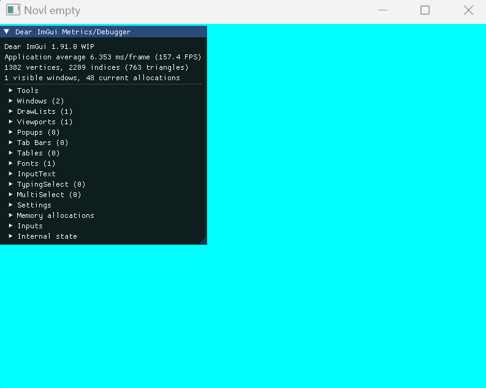
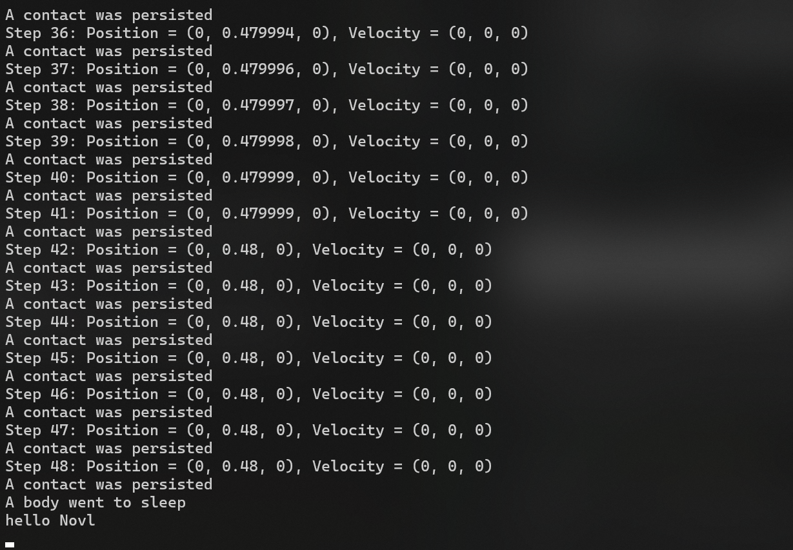
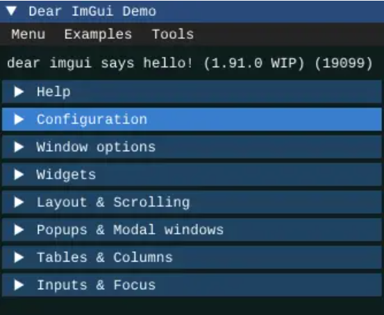
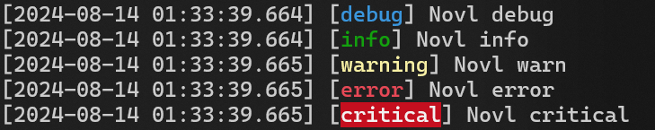
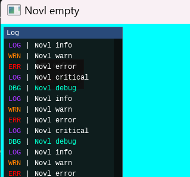

# 游戏制作的窄门：构建mini游戏引擎 - 1 - Third Party Libs

## 0. C++项目中的第三方库
本系列的项目是一个C++项目，不幸的是C++并没有像其他很多语言一样有个很好用的包管理工具，类似Java的Maven或者Python的Anaconda之类，所以我们需要稍微麻烦一点来把第三方库集成进项目里（xmake的包管理博主还没研究明白，可能之后会用上）  
- 可以把第三方库的源码放进项目，作为依赖的子项目一起构建，举例在本系列中即`Libs/{LibName}/src`中放进源码，然后另外写一个xmake.lua来构建这个子项目，然后在我们主项目的xmake.lua中添加这个子项目的依赖即可
- 也可以直接把第三方库构建成动态/静态库文件（在Windows下就是.dll和.lib文件），然后直接在项目中link即可，在本系列中会在`Libs/{LibName}/bin`中放入第三方库文件  
直接把构建好的库文件放进项目里用的缺点就是针对每个平台和架构都得放一套binary文件，但是每次构建会快一点，且文件结构也更清晰一些，不会有文件太多看着很乱的感觉，本系列大部分第三方库文件选用这样的结构来集成第三方库  
在xmake.lua中，我们把这些库link到主项目上
```lua
-- static
libs = {"LibNames"}

for _,lib in ipairs(libs) do
    add_includedirs(string.format("../Libs/%s/include",lib))
    add_linkdirs(string.format("../Libs/%s/bin/$(plat)/$(arch)"),lib)
    add_links(lib)
end

-- shared
libs = {"LibNames"}

for _,lib in ipairs(libs) do
    add_includedirs(string.format("../Libs/%s/include",lib))
    add_linkdirs(string.format("../Libs/%s/bin/$(plat)/$(arch)"),lib)
    add_links(string.format("%sdll",lib))
end
```

## 1. 图形API
图形渲染是游戏引擎最重要的部分之一，在这一篇中我们首先来构建图形渲染的环境依赖
在图形渲染中有多种图形API可用，经典的OpenGL/DX9，以及更modern一点的metal/vulkan/dx11/dx12，包括Console上也有自己的图形API比如PS4上的GNM、Switch上的NVN等  
在本系列的开端，博主倾向于从最basic的东西做起，所以来到我们熟悉的OpenGL   
***当然，想要构建一个modern游戏引擎而不是一个古早技术玩具，需要使用现代一些的图形API，本系列在后面图形渲染部分计划加上vulkan & metal的backend支持，但是我们先从用OpenGL作为backend开始*** 

### OpenGL的libs
在学习OpenGL的过程中，可能会接触到多种OpenGL的库，比如glut/glew/glad/glfw，具体的区别一搜就有，结论就是glut是很古早的库了，基本可以进博物馆，glew基本是包含了OpenGL的core内容，但是也比较古早了，稍微新一点的（当然也不会太新，新的都去搞vulkan了）是glfw和glad，一般做OpenGL是用这两个库，glfw是给了一个跨平台的窗口和一些类似鼠标事件、键盘事件一类东西，glad基本上是一个glew的升级版  
下面开始把`glad`和`glfw`集成进项目

### glad
glad的获取非常舒适，在[这个网站](https://glad.dav1d.de/)可以选择你需要的OpenGL的版本、需要的扩展等  
选完之后生成的glad.h中会注释选择的信息
```
Language/Generator: C/C++
Specification: gl
APIs: gl=4.6, gles2=3.2
Profile: core
Extensions:
```
此处会生成glad.h和khrplatform.h，以及glad.c，注意如果在网站中生成的时候勾选上了`Omit KHR`选项，即不生成khrplatform.h这个文件，后面编译的时候会报错，这个在没那么古老的版本都会出现，只能保留khrplatform.h文件  

然后可以写个简单的xmake脚本来把glad构建成静态库使用：
```lua
target("glad")
    set_kind("static")
    add_includedirs("include")
    add_files("**.cpp")
target_end()
```

### glfw
glfw可以直接在[GitHub](https://github.com/glfw/glfw)上获得源码，也可以直接下载到编译好的文件，博主采用的方式是编译源码  
先用CMake生成一个VS项目：`cmake -S path/to/glfw -B path/to/build`，如果想把glfw作为动态库使用，需要加上`-DBUILD_SHARED_LIBS=ON`的tag  
然后用VS打开生成的.sln,生成glfw项目 

>注意此时可能会有个小坑，我们首先要确定这个项目在Windows下的runtime是`\MD`，并且其他的库在编译的时候同样使用MD作为runtime，不然把库放进主项目link的时候会有报错  

然后我们就可以得到glfw的.lib文件，把它和include一起放进引擎项目即可  
在此时尝试xmake构建一下放入了glad和glfw的项目，结果发现还是会报错
```
无法解析的外部符号 __imp_TranslateMessage，函数 _glfwInitWin32 中引用了该符号
```
通过搜索TranslateMessage，发现这是Windows的User32库里的，我们在项目中没有link，以此类推，得到我们在Windows平台下需要的所有系统库，link进项目中
```lua
-- platform related
if is_plat("windows") then 
    add_syslinks("opengl32","user32","Gdi32","Shell32")
end 
```

## 2. UI库 - imgui
在游戏引擎的Editor中我们需要展示各种信息，以及提供各种可以交互的组件，这种功能商业引擎一般是自己写底层轮子，比如UE的Slate，但是个人开发中还是选择用现成的库比较方便，主流的选择是ImGui，它文档里说为了不混淆，引用的时候最好叫全名Dear ImGui，Ok fine  
ImGui其实并不是一个性能突出的选择，UI框架也分几种，比如立即模式（immediate mode）或者保留模式（retained mode）等，ImGui的Im就是immediate mode的意思，这种模式不管有没有变动，每帧都会刷新渲染UI，并不是性能最优选择，但是好用、轻量，多平台支持友好（能画纹理图片的地方就能用ImGui！）所以本系列的Editor UI框架交给Dear ImGui  

ImGui的源码依然是在[Github](https://github.com/ocornut/imgui)上拿到，但是编译和之前不太一样，ImGui官方推荐直接把ImGui的文件放到项目文件中作为项目的一部分一起构建（也并不是作为一个子项目），但强迫症使然，博主这里把ImGui也编译成一个静态库来用  

根据ImGui的文档，我们需要源码中根目录下的文件和backends目录下的相应文件，把这些文件拿出来到`Libs/ImGui/src`中，简单构建成静态库：
```lua
target("ImGui")
    set_runtimes("MD")
    set_kind("static")
    add_includedirs("../include", "../../glfw3/include")
    add_files("**.cpp")
target_end()
```
然后把刚刚拿出来的文件其中的.h部分放进include文件夹  

在这步之后可以简单验证一下目前集成的lib的状态，我们构建一个glfw窗口和一个ImGui的demo window，仍然在之前的test.cpp中进行实验：  
```cpp
#include "pch.h"
#include "test.h"
#include <glad.h>
#include <glfw3.h>
#include <imgui.h>
#include <imgui_impl_glfw.h>
#include <imgui_impl_opengl3.h>

void framebuffer_size_callback(GLFWwindow *window, int width, int height);

void Test::test()
{
    std::cout << "hello Novl" << std::endl;

    // init glfw
    glfwInit();
    glfwWindowHint(GLFW_CONTEXT_VERSION_MAJOR, 3);
    glfwWindowHint(GLFW_CONTEXT_VERSION_MINOR, 3);
    glfwWindowHint(GLFW_OPENGL_PROFILE, GLFW_OPENGL_CORE_PROFILE);

    // init window
    GLFWwindow *window = glfwCreateWindow(800, 600, "Novl empty", NULL, NULL);
    if (window == NULL)
    {
        std::cout << "Failed to create GLFW window" << std::endl;
        glfwTerminate();
        return;

    }
    glfwMakeContextCurrent(window);

    // init glad
    if (!gladLoadGLLoader((GLADloadproc)glfwGetProcAddress))
    {
        std::cout << "Failed to initialize GLAD" << std::endl;
        return;
    }

    glViewport(0, 0, 800, 600);

    glfwSetFramebufferSizeCallback(window, framebuffer_size_callback);

    // imgui
    // Setup Dear ImGui context
    IMGUI_CHECKVERSION();
    ImGui::CreateContext();
    ImGuiIO &io = ImGui::GetIO();
    io.ConfigFlags |= ImGuiConfigFlags_NavEnableKeyboard; // Enable Keyboard Controls
    io.ConfigFlags |= ImGuiConfigFlags_NavEnableGamepad;  // Enable Gamepad Controls

    // Setup Platform/Renderer backends
    ImGui_ImplGlfw_InitForOpenGL(window, true);
    ImGui_ImplOpenGL3_Init("#version 460");

    while (!glfwWindowShouldClose(window))
    {
        glfwPollEvents();

        // (Your code process and dispatch Win32 messages)
        // Start the Dear ImGui frame
        ImGui_ImplOpenGL3_NewFrame();
        ImGui_ImplGlfw_NewFrame();
        ImGui::NewFrame();
        ImGui::ShowMetricsWindow(); // Show demo window! :)

        ImGui::Render();
        glClearColor(0.0,1.0,1.0,1.0);
        glClear(GL_COLOR_BUFFER_BIT);
        ImGui_ImplOpenGL3_RenderDrawData(ImGui::GetDrawData());
        glfwSwapBuffers(window);
    }

    ImGui_ImplOpenGL3_Shutdown();
    ImGui_ImplGlfw_Shutdown();
    ImGui::DestroyContext();

    glfwTerminate();
}

void framebuffer_size_callback(GLFWwindow *window, int width, int height)
{
    glViewport(0, 0, width, height);
}
```

然后进行构建以及xmake run：  
  

OK，这样ImGui和OpenGL的集成完成了  

## 3. FMOD
在上一篇中讲过，我们选择FMOD作为音频的Middleware，但是网上关于如何集成FMOD到自己的C++项目中的资料比较少，大部分是如何集成FMOD到Unity/UE/Godot的教程，博主找到一篇[集成FMOD进自己的C++项目](https://codyclaborn.me/tutorials/setting-up-xcode-and-visual-studio-for-fmod-development/)的文档，照着这个来就OK  

没什么好说，FMOD并不提供源码，所以下载相应平台的lib文件，把FMOD的Core和Studio的include和二进制lib文件放进相应文件夹即可  

但是注意，博主这里集成进项目的是FMOD Core，根据官网描述  
>FMOD Core is suitable for projects that need a lightweight low-level audio engine or have special device requirements. FMOD Core functionality is exclusively available through the API.

>If you're a game developer, FMOD Studio is generally the recommended solution. It offers data-driven approach that allows audio artists to create adaptive audio content for games using high-level authoring tools.    

FMOD Core是更底层的音频引擎，只能通过调API去访问它的功能，这正是我们想要的  
FMOD Studio应该更偏向于使用它去做一些Sound Design，在此暂不集成进这个mini engine

集成完之后测试一下有没有问题，其实FMOD Core里面有一些example可以直接copy过来测试，但是有点长，感兴趣的朋友可以这样做，在此博主就只在test.cpp中调用一下FMOD的函数看看有没有报错就ok：
```cpp

// ...other includes
// ...
#include <fmod.h>
#include <fmod.hpp>

void main(){
    std::cout << "hello Novl" << std::endl;

    // init fmod
    FMOD::System *system;
    FMOD::Sound *sound;
    auto res = FMOD::System_Create(&system);

    // previous tests
    // ...
}
```
构建运行一下，一切正常没有报错，ok，下一个

## 4. Jolt
现在到了需要集成的物理Middleware部分，这部分选择Jolt Engine，就像上一篇说的那样  
首先直接在[Github](https://github.com/jrouwe/JoltPhysics)中下载到Jolt的源码，这个源码中Jolt文件夹里的内容是我们高度关注的，基本是只需要这里面的东西  
Jolt的源码中有一个`HelloWorld`子项目，里面只有一个cpp文件，我们可以把这个偷过来用来验证Jolt的集成是否成功  

首先拿到Jolt之后他的`Build`目录下的各种脚本非常保姆级，基本是一键CMake，直接可以构建VS的工程文件，构建完之后直接在VS中编译即可  

我们同样在`Libs/Jolt`目录下集成Jolt库，由于Jolt源码中大多数include都是include的\<Jolt/xxx.h>, 所以我们的include目录中多一层Jolt目录，在VS中编译完之后（编译的Distrubution版本以缩小包体大小），找到Jolt.lib(有61mb，还蛮大的吼)，放进bin目录中，然后在include/Jolt中放入源码中Jolt目录下的文件（递归地把.cpp文件都删了减少文件大小），这样做之后Jolt目录的结构如下：
```
├─bin  
│  └─windows  
│      └─x64  
└─include  
    └─Jolt  
        ├─AABBTree  
        │  ├─NodeCodec  
        │  └─TriangleCodec  
        ├─Core  
        ├─Geometry  
        ├─Math  
        ├─ObjectStream  
        ├─Physics  
        │  ├─Body  
        │  ├─Character  
        │  ├─Collision  
        │  │  ├─BroadPhase  
        │  │  └─Shape  
        │  ├─Constraints  
        │  │  └─ConstraintPart  
        │  ├─Ragdoll  
        │  ├─SoftBody  
        │  └─Vehicle  
        ├─Renderer  
        ├─Skeleton  
        ├─TriangleGrouper  
        └─TriangleSplitter  
```
然后我们在主项目的xmake.lua中添加Jolt的link，把它当作Static lib来和主target进行链接：
```lua
-- target Novl
-- ...
-- link to target
-- static
libs = {"glad","glfw3","ImGui","Jolt"}
-- ...
```

然后可以xmake一下看看能不能成功构建，结果是会报错：  
```
找到 MSIL .netmodule 或使用 /GL 编译的模块；正在使用 /LTCG 重新启动链接；将 /LTCG 添加到链接命令行以改进链接器性能
```
很奇怪的一个报错，初看并不知道是在干什么，Google一下发现可能还是编译Jolt的时候runtime没选对，回到之前Jolt源码构建出来的VS工程中把子项目的runtime都设置成和本项目相同的MD，再构建一次，把构建出来的Jolt.lib放回来  
然后再xmake一下，这次xmake成功了  

接着是把Jolt中的hello world工程偷过来测试一下是否集成成功，我们测试程序还是通过Novl Editor中的hello.cpp调用Novl里的test.h中的方法来进行，在test.h中加一个helloJolt的方法：
```cpp
class NOVL_API Test
{
    // previous code
    // ...
    void helloJolt();
};
```
然后把Jolt源码中的HelloWorld.cpp直接复制，粘贴到Novl中和test.h同目录下新建的一个helloJolt.cpp中，需要做两处改动：  
- include一下test.h
- 把其中的`main()`改为`void Test::helloJolt()`
然后在Novl Editor中的hello.cpp中调用一下
```cpp
int main(){
    Test myTest;
    myTest.test();
    myTest.helloJolt();
}
```

然后重新构建xmake一下，构建成功之后直接`xmake run`，程序是可以运行的，test()方法构建出来的窗口弹出来了，但是到运行helloJolt()方法的时候又会报错：  
`Version mismatch, make sure you compile the client code with the same Jolt version and compiler definitions! Mismatching define JPH_OBJECT_STREAM`  
并不知道这是什么，把JPH_OBJECT_STREAM放进Jolt源码中搜索发现一次更新log中写
> Added macro JPH_OBJECT_STREAM that controls if ObjectStream is compiled or not. By default this is turned on, so you should not see a change, but if you compile without cmake you may need to define JPH_OBJECT_STREAM

ok，看起来应该是需要define这个东西，在项目xmake中新增define
```lua
-- Third party related defines
add_defines("JPH_OBJECT_STREAM")
```

重新构建并运行，HelloWorld中应该有的结果正常显示在命令行
  

## 5. FreeType
在ImGui中，默认的字体渲染库是stb_truetype，这个库非常轻量，但是渲染效果比FreeType差一些，博主选择集成FreeType来完成对.ttf字体文件的渲染

FreeType的集成同样简单，在[官方Git](https://github.com/freetype/freetype)中可以找到源码下载，打开.sln用VS编译即可，编译出来静态链接库之后，把include和二进制.lib放进项目中相应的地方就ok

接下来让ImGui使用FreeType来渲染：

首先把ImGui目录下misc/freetype中freetype相关的.h文件放进我们项目中ImGui的include中，把.cpp文件放进我们项目中ImGui的src中重新编译出来ImGui.lib

然后再imconfig.h中找到`#define IMGUI_ENABLE_FREETYPE`  
开启这个define

此时ImGui已经可以用freetype来渲染字体了，我们在test.cpp中实验一下：

```cpp
ImGuiIO &io = ImGui::GetIO();
io.Fonts->AddFontFromFileTTF("../../../../Assets/Fonts/Cousine-Regular.ttf",14);
```


可以看到这样ImGui就可以用freetype来渲染.ttf字体了

## 6. spdlog
### 6.1 Integrate spdlog
对于任何一个程序，我们都希望可以很好地输出log进行debug以及直到程序运行时的必要信息，而spdlog是一个很好用的跨平台的、header only的库，本系列中采用spdlog来作为log输出库  
spdlog的集成更简单，因为是header only的库，只要include进去它的头文件就好  
```lua
-- xmake.lua
-- ...

-- link to target
-- header only
libs = {"spdlog"}

for _, lib in ipairs(libs) do
    add_includedirs(string.format("../Libs/%s/include",lib))
end
-- ...
```

然后在test.cpp中测试：
```cpp
/*
    spdlog TEST
*/
spdlog::set_level(spdlog::level::level_enum::debug);
spdlog::debug("Novl debug");
spdlog::info("Novl info");
spdlog::warn("Novl warn");
spdlog::error("Novl error");
spdlog::critical("Novl critical");
```
print出来结果如下：  


### 6.2 ImGui as sink for spdlog
目前为止，我们输出的所有内容都是在Console中输出的，而在游戏引擎中，我们希望log打印到引擎Editor的界面tab中，所以博主希望把Novl Engine的log输出到ImGui中，而在Github上找到了[dear_spdlog](https://github.com/awegsche/dear_spdlog)项目，可以用来做这个事情  
接下来把dear_spdlog集成进Novl Engine中

dear_spdlog只有一个.h文件和一个.cpp文件，这次并不把它编程lib来使用了，直接放在`Core/Log`目录下使用  
在`test.cpp`中进行如下修改：
```cpp
void Test::testLibs()
{
    /*
        dear_spdlog TEST
    */
    const auto ssink = imgui_sink_mt();

    // Setup other libs
    // ...

    while (!glfwWindowShouldClose(window))
    {
        // others
        // ...

        /*
            ImGui as sink for spdlog
        */
		ImGui::Begin("esfhie", nullptr);
		ImGui::TextColored(ImColor(1.0f, 0.0f, 0.0f, 1.0f), "red");
		ImGui::SameLine();
		ImGui::TextColored(ImColor(0.0f, 1.0f, 0.0f, 1.0f), "green");
		ImGui::End();
        spdlog::debug("Novl debug");
        spdlog::info("Novl info");
        spdlog::warn("Novl warn");
        spdlog::error("Novl error");
        spdlog::critical("Novl critical");

		ssink->draw_imgui();

        // others
        // ...
    }

}
```
然后编译，run一下：  
  
成功把log输出在ImGui里面

此时我们可以在Windows下隐藏运行程序时会弹出的Console了
```cpp
// hello.cpp - main()
#ifdef NOVL_PLAT_WINDOWS
    FreeConsole();
#endif
```
这样在运行NovlEditor.exe的时候，Console就不会弹出来，我们需要打什么log直接在ImGui中显示
## 7. Batch Scripts
一个小番外：在集成各种库的时候需要手动创建各种空文件夹，以及手动删除多级目录中不需要的文件（如Jolt就需要删除多级目录中的.cpp文件，因为不需要，当然不删也ok，但是多余），博主写了几个.bat脚本来自动化一些重复工作，这种方式带来非常舒适的工作流，这些脚本在项目的Build目录下：
```
│  WindowsBuild.bat
│  WindowsCleanBuild.bat
│  xmake.lua
│
└─Scripts
        CreateEmptyFolders.bat
        DelCppFiles.bat
```
**其中两个Windows构建相关的bat在频繁构建run和清理构建生成文件的时候很有用**  

`CreateEmptyFolders.bat`是用来在新集成一个第三方库时放进`Libs/{thisLib}`目录下，直接生成空目录
```
├─bin
│  └─windows
│      └─x64
└─include
```
`DelCppFiles.bat`就是递归删除某个后缀的所有文件，在Jolt的集成中删的是cpp，以后需要删什么其他的小改一下这个.bat文件就行了