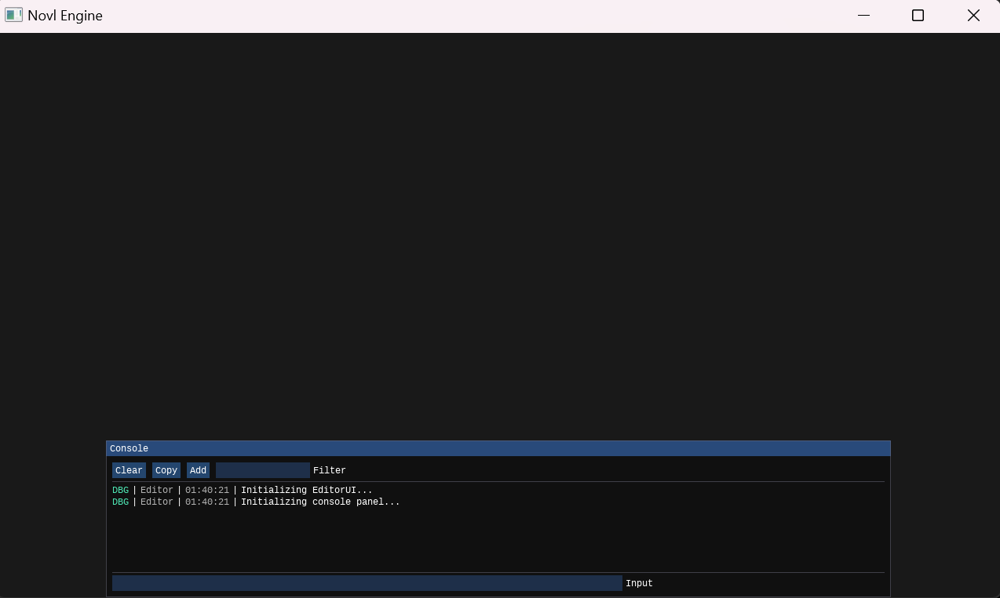

# 游戏制作的窄门：构建mini游戏引擎 - 2 - Window & Editor UI

很久没有更新这个code base，主要是工作忙起来了，且拖延，并且在上一篇写完之后纠结了很久下一步做什么，不断在看网上其他游戏引擎相关的教程和tech blog，越看越觉得自己接下来面对的工程又大又复杂，但是最近告诉自己OK，做一些简单的规划，就从细节开始吧，看了很多fancy的技术，code base里什么都没有，那就从细节开始好了。所以决定先做一些简单的地基，后面的东西同步学习，整理明白一些了再往这个code base里面加，反正早晚是要重构以及再次重构的。  

## 0. Runtime & Editor Framework
之前的工程在Editor端只调用了一个`testLib()`函数，是写在Runtime里的，所有一切都在这里面，这显然不行。  
今天来实现一下Editor和Runtime的分离，首先Runtime需要有一个Window System，管理各种平台给出的Window，比如在Windows平台上使用glfw的window来实现（虽然glfw本身就是一个跨平台抽象window），然后Editor端作为一个Application作用是调用Runtime的Window接口创建一个Window，在上面做事情，ImGui的各种调用也大多数（此处有大坑）应该放在Editor端做  
上篇简单实现了一下在ImGui的窗口里print log，但是在Runtime和Editor分离了之后，Logging System放在Runtime的Core部分，所以这一部分也需要修改，放在后面好了

如上所述，之前的Editor端相当于不存在，所有工作都在Runtime端实现，那么现在重新梳理一下：  
> **Runtime**: 作为lib存在，提供Platform/Core/Resource/Details层面的功能支持，供Editor调用   
> **Editor**: 作为一个独立的Application，有自己的UI管理（Editor上的各个Panel）  

我希望Runtime可以控制整个游戏的初始化、main loop和真正执行的资源管理、渲染操作等，而Editor只是一个与用户交互的Shell，接下来分别做出Runtime和Editor的雏形

### 0.1. Runtime
我在这里OOP一点，Runtime在游戏中应该有且仅有一个实例，这个实例就像游戏中真正的背后Boss一样掌管世界的周期与运行、持有窗口、管理事件...等等，这仅有的实例先来用一个简单的单例来实现（btw，看过一个不错的[游戏设计模式blog](https://gpp.tkchu.me/singleton.html)讲不要滥用单例模式，但对于非常特殊的Runtime实例，就来用一下）：  

```cpp
// Novl.h
class NovlRuntime {
  private:
    NovlRuntime();
    NovlRuntime(const NovlRuntime &) = delete;
    NovlRuntime(NovlRuntime &&) = delete;
    NovlRuntime &operator=(const NovlRuntime &) = delete;
    NovlRuntime &operator=(NovlRuntime &&) = delete;

  public:
    ~NovlRuntime();

    inline static NovlRuntime &Get() {
        static NovlRuntime s_Runtime;
        return s_Runtime;
    }

  private:
    void init();        // initialize the game world
    void shutdown();    // destroy the game world

    void tick();        // tick one frame
    void flush();       // flush once

  private:
    bool m_initialized = false;
    bool m_running = false;
};
```
如上，Runtime的能力暂时只有这些，其中tick()和flush()因为某些原因分开操作，后面会提及  

### 0.2. Editor
Editor的构成暂时很简单，只是一个空的App，能调用Runtime就好  

```cpp
// NovlEditor.h
class NovlEditor{
public:
    NovlEditor();
    ~NovlEditor();
    void init();
    void update();
    void close();
private:
    n_uptr<EditorUI> m_GUI;
};
```
而在Editor的实现中，应该在init的时候初始化Runtime实例，在close的时候shutdown掉Runtime，在update的时候让runtime去tick & flush就好了，如下：

```cpp
// NovlEditor.cpp
void NovlEditor::init(){
    // init runtime
    NovlRuntime::Get();
}
void NovlEditor::close(){
    // close runtime
    NovlRuntime::Get().shutdown();
}   
void NovlEditor::update(){
    // Runtime tick logic & render
    NovlRuntime::Get().tick();
    // swap window buffer
    NovlRuntime::Get().flush();
}
```

而在我的Editor App中，需要一个Entry，那么main()就在这个Entry里面，如下
```cpp
// Entry.cpp
int main() {
#ifdef NOVL_PLAT_WINDOWS
    // 如果没有FreeConsole()，那么打开Novl Editor.exe的时候会跟着窗口一起弹出来一个console界面，蛮烦人的
    // FreeConsole();
#endif
    Novl::NovlEditor editor;
    editor.init();
    while (!Novl::NovlRuntime::Get().isWindowClose()) {
        editor.update();
    }
    editor.close();
}
```
## 1. Window System
显然，如果只针对一个平台开发的话，并不需要一个抽象的window manager类似物来管理game engine的窗口，只需要直接调用平台窗口API即可，但如果需要跨平台，那么一个抽象出来的Window是有必要的  
这里构建一个Window类来作为所有Window的base class：  
```cpp
// NovlWindow.h
struct WindowData {
	n_string title;
	uint32_t width;
	uint32_t height;
	WindowData( const n_string& title = "Novl Engine",
				uint32_t width = 1280,
				uint32_t height = 720)
			:title(title),width(width),height(height){}
};

// Desktop WindowBase
class WindowBase {
public:
	friend class NovlRuntime;
	virtual ~WindowBase() {}
	
	virtual uint32_t getWidth() const = 0;
	virtual uint32_t getHeight() const = 0;
	virtual void* getNativeWindow() const = 0;  // get pointer to actual native window instance
	virtual bool isVSync() const = 0;
	virtual bool isClose() const = 0;
protected:
	virtual void update() = 0;
	virtual void endFrame() = 0;
	virtual void setVSync(bool enabled) = 0;
	static WindowBase* Create(const WindowData& wdata = WindowData());
};
```
Window需要可以get到他的一些属性，以及可以获得一个底层Native Window的Handle（有的时候需要作为参数传进一些函数，比如ImGui的初始化）  
剩下没什么好说的，update/endFrame/设置VSync，很符合我对一个Window的想象  

我希望我可以通过一个Create函数来创建一个我需要的window，不管平台差异，只要我Create()一下，就能得到目前平台上的一个Window，这里使用一个工厂模式类似物来实现这样的东西：
```cpp
// NovlWIndow.cpp
WindowBase* WindowBase::Create(const WindowData& wdata){
#ifdef NOVL_PLAT_WINDOWS
        return new WindowsWindow(wdata);
#else
    #error Unsupported Platform!
#endif
        return nullptr;
    }
```
里面出现的WindowsWindow是WindowBase的一个子类，马上去实现它：
```cpp
// WindowsWindow.h
class WindowsWindow final
    :public WindowBase{
public:
    WindowsWindow(const WindowData& wdata);
    ~WindowsWindow();
    inline uint32_t getWidth() const override { return m_data.width; }
    inline uint32_t getHeight() const override { return m_data.height; }
    void* getNativeWindow() const override { return static_cast<void*>(m_window);}
    inline bool isVSync() const override { return m_isVSync; }
    bool isClose() const override;
private:
    void init();
    void shutdown();
    void update() override;
    void endFrame() override;
    inline void setVSync(bool enabled) override;
private:
    bool        m_isVSync;
    GLFWwindow* m_window;
    WindowData  m_data;
};
```
OK,在Windows中，这里使用glfw来作为Window，而不是Win32窗口，这样在glfw可以跨到的平台中就可以偷懒复用，glfw不支持的平台中再单独写一个xxxWindow来实现

WindowsWindow的具体实现不多赘述，可以看代码中实现，基本是上篇中把glfw窗口的操作搬过来拆分在各个流程中  
需要注意的是endFrame()这个函数是用来调用glfwSwapBuffers()的，这个函数会刷新窗口的显示，所以其实Runtime当中的flush()在这里调用相应窗口的endFrame()  

有了Window系统之后，可以在Runtime中创建一个Window来：
```cpp
// --- Novl.h ---
class NovlRuntime {
public:
    // ...
private:
    // ...
    n_uptr<WindowBase> m_window;
};

// --- Novl.cpp ---
void NovlRuntime::init(){
    // ...
    // init window
    m_window = n_uptr<WindowBase>(WindowBase::Create());
    m_initialized = true;
    // ...
}

void NovlRuntime::tick(){
    // update window
    m_window->update();
    return;
}

void NovlRuntime::flush(){
    // swap window buffer
    m_window->endFrame();
}
```
>上面的Novl.h中出现了一个n_uptr<>，这个其实暂时就是一个std::unique_ptr的别名，在`/Core`目录下新建了一个Type.h来include一些自定义的type或者容器，或者某些容器不想用STL里面的实现，之后可以改掉，但是目前都是STL实现的马甲罢了  

此时可以编译得到一个空Window的程序，总归算把Runtime-Editor跑起来了

## 2. Editor UI
有了Runtime和Editor的分离以及一个原始的Window System之后，我希望在Editor上搭建一个UI系统，使用ImGui，并且并不想让Runtime端接触到ImGui，因为我只想在Editor中用ImGui作为UI，所以  
首先尝试把ImGui相关的操作全部放在Editor中，即：在Editor初始化的时候初始化ImGui  
---> 结果是不可行的，因为ImGui-glfw初始化的时候，即执行ImGui_ImplGlfw_InitForOpenGL()的时候，需要一个GLFWwindow*作为参数，我尝试用Novl Runtime的getNativeWindow来得到一个void*（因为Runtime不关心平台具体实现，所以不和WindowsWindow做直接交互），传到Editor之后再cast回GLFWwindow*，结果报错：  
```
---
    Assertion failed: bd->PrevWndProc != nullptr, file imgui_impl_glfw.cpp, line 636
    error: execv(C:\Users\Projects\NovlEngine\Build\build\release\windows_x64\Novl Editor.exe ) failed(-1073740791)
---
```
然后尝试把ImGui的初始化也放在Runtime，在Runtime抽象出来一个UI类，在Editor实现一个EditorUI的子类  
---> 仍然没有解决问题，还是报错，虽然两边指针指向的地址是一致的，但是好像并不指向同一块物理内存，这是一个DLL跨边界问题 

最终，把ImGui render backend的初始化放在Runtime中，而ImGui context的创建放在Editor中，已经病急乱投医了，但是结果是Render Backend需要ImGui的context，找不到context了  
---> 最终解决方案就是Runtime不再作为DLL而是一个static lib存在，这样就没有DLL跨边界问题的大坑了,可以get到GLFWwindow*之后，直接在Editor端做全部的ImGui操作就可以   

> 只能说还是菜，C++学的不好，折腾半天才搞定一个很傻的问题  

所以最终，Editor UI的部分就是把上一篇的test函数中ImGui相关的东西都放在EditorUI里，然后在跟随Editor实例一起init/close/update即可，注意这里的update就在Runtime的tick和flush之间，**这就是为什么Runtime的tick和flush是分开的**，因为Runtime的逻辑tick完了之后，Editor也得做一下update，才能对Window进行flush，也就是调用Window的endFrame()，如下： 
```cpp
// NovlEditor.cpp
void NovlEditor::update(){
    // Runtime tick logic & render
    NovlRuntime::Get().tick();
    // update & draw Editor GUI
    m_GUI->update();
    m_GUI->draw();
    // swap window buffer
    NovlRuntime::Get().flush();
}
```

然后Editor的UI终于可以正常使用了，如果在EditorUI::draw()中调用ImGui::ShowDemoWindow(),就可以像上一篇一样展示出一个ImGui的Demo窗口来  

## 3. New Log System & Console Panel
上一篇中，我们使用了一个dear_sink来在ImGui窗口中print log，但是在这里并不适用，因为dear_sink的使用方式是创建一个logger并且设置为默认的logger，而Novl中的Log System为Runtime和Editor分别创建了logger，并且dear_sink的ImGui使用方式也与刚刚构建的UI系统不兼容，那么需要自己写一个ImGui的sink来实现这个东西
```cpp 
// Novl/src/Core/Log/Sink/gui_sink.h
struct log_item {
    bool isCmd = false;
    n_string msg;
    n_string logger;
    spdlog::log_clock::time_point time;
    spdlog::level::level_enum level;
};

template <typename Mutex> class gui_sink : public spdlog::sinks::base_sink<Mutex> {
  public:
    gui_sink(n_sptr<n_cqueue<log_item>> msg_queue) {
        messages = std::move(msg_queue);
    }

    void set_max_shown_messages(size_t max) {
        max_msg = max;
    }

  protected:
    void sink_it_(const spdlog::details::log_msg &msg) override {
        // sink_it_ is thread-safe, no more lock & unlock operation needed
        // see spdlog/sinks/base_sink-inl.h
        if (messages->isFull()) {
            messages->dequeue();
        }
        log_item it;
        it.msg = n_string(msg.payload.data(), msg.payload.size());
        it.logger = n_string(msg.logger_name.data(), msg.logger_name.size());
        it.level = msg.level;
        it.time = msg.time;
        messages->forceEnqueue(std::move(it));
    }
    void flush_() override {
        // since we directly push log items into target container, we don't need to flush it
    }

  private:
    uint16_t max_msg = MAX_LOG_MSG;
    n_sptr<n_cqueue<log_item>> messages;
};

typedef n_sptr<gui_sink<n_mutex>> gui_sink_mt_t;

inline const gui_sink_mt_t gui_sink_mt(n_sptr<n_cqueue<log_item>> target) {
    return std::make_shared<gui_sink<n_mutex>>(std::move(target));
}
```
这个Sink的功能是：在初始化的时候需要传入指向一个环形队列的指针（也就是<n_cqueue>，一个自己实现的简单容器），然后打log的时候就是把log item传进这个Circular queue  

OK，我们有了新的Log sink，但是需要传进去的这个环形队列在哪维护呢？  
在Editor的DataManager里，对于Runtime和Editor的数据交互，我希望有一个全局的Data manager来管理这个事情，所以在这里构建一个Data manager，同样是一个单例：
```cpp
// EditorDataManager.h
struct log_item;
class EditorDataManager {
private:
    EditorDataManager();
    EditorDataManager(const EditorDataManager&) = delete;
    EditorDataManager(EditorDataManager&&) = delete;
    EditorDataManager &operator=(const EditorDataManager&) = delete;
    EditorDataManager &operator=(EditorDataManager&&) = delete;

public:
    ~EditorDataManager();

inline static EditorDataManager& Get() {
    static EditorDataManager s_Instance;
    return s_Instance;
}
inline n_sptr<n_cqueue<log_item>> getLogContainer() const {
    return m_logMsgs;
}

private:
    n_sptr<n_cqueue<log_item>> m_logMsgs;
};
```
而在他初始化的时候，把环形队列创建出来，并且把Sink Add进Novl的log system中
```cpp
// EditorDataManager.cpp
EditorDataManager::EditorDataManager() {
    m_logMsgs = make_shared<n_cqueue<log_item>>(MAX_LOG_MSG);

    // construct ui sink for editor
    auto ui_sink = gui_sink_mt(m_logMsgs);
    EDITOR_ASSERT(ui_sink, "ConsolePanel: init failed because log container is null!");
    Log::AddSink(std::move(ui_sink));
}

// Log::AddSink如下，在Log.cpp中
void Log::AddSink(log_sink &&sink){
	auto &rtSinks = s_RuntimeLogger->sinks();
	auto &edtSinks = s_EditorLogger->sinks();
	rtSinks.emplace_back(sink);
	edtSinks.emplace_back(sink);
}
```

这样就可以在正常的使用log，并且把log推进环形队列中，接下来就是在UI中把环形队列中的log item展示出来，这样就可以在Editor的UI界面中展示log了  
具体的实现在ConsolePanel.cpp中，这是对于ImGui Demo中的Console做改造而来的，实现之后的效果如下： 
  

> 那么这篇就到这里，下面计划做的是Event System和Layer，虽然进行到此还没有画出来一个三角，但是正如Cherno的Game Engine系列教程也是铺垫许久才开始Render System的构建  
渲染是很让人有正反馈，很exciting的东西，但是游戏引擎除了渲染之外还有许多，慢慢来